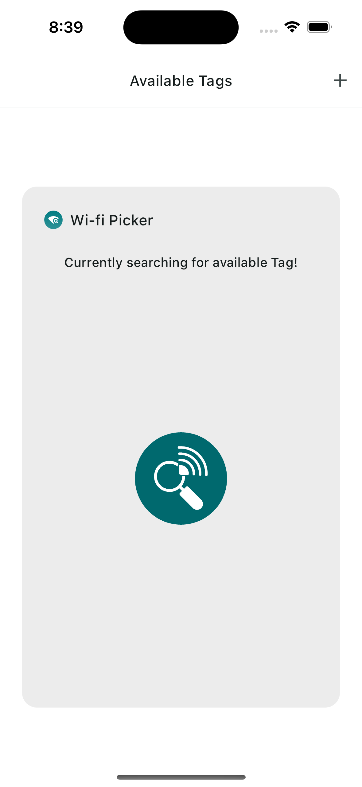
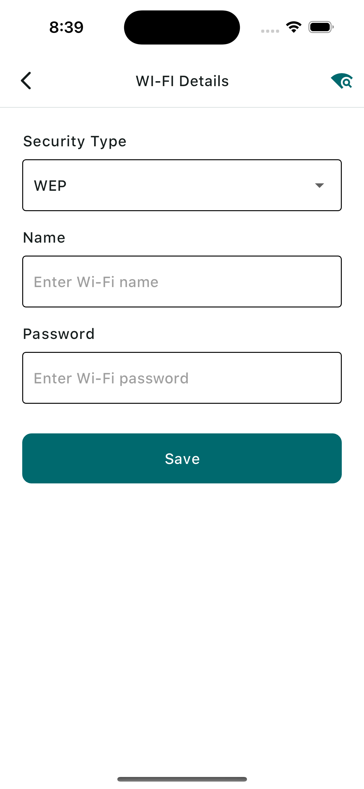
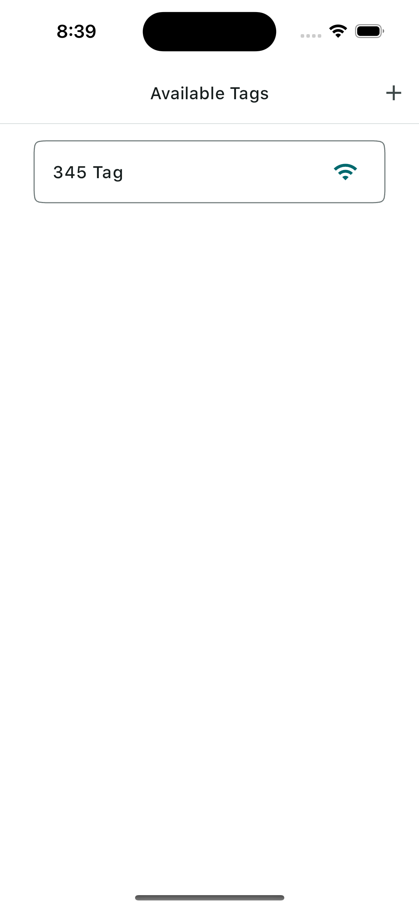

# WIFI Picker (HNG Task 5)

## Description

The NFC WiFi Sharing App that simplifies the process of sharing WiFi credentials. Users can effortlessly connect to WIFI networks by tapping their NFC-enabled devices against a designated NFC tag.

### Types

- feat: A new feature
- fix: A bug fix
- docs: Documentation only changes
- style: Changes that do not affect the meaning of the code
- refactor: A code change that neither fixes a bug nor adds a feature
- perf: A code change that improves performance
- test: Adding missing tests or correcting existing tests
- build: Changes that affect the build system or external dependencies
- ci: Changes to our CI configuration files and scripts
- chore: Other changes that don't modify src or test files
- revert: Reverts a previous commit
...

## Objectives

- Simplifies WiFi Credential Sharing: Allows users to connect to WiFi networks by tapping their NFC-enabled devices against a designated NFC tag.
- Beautiful UI: Features an attractive and user-friendly interface.
- Proper Error Handling: Ensures robust and seamless operation with appropriate error messages and handling.
- Write WiFi Credentials to NFC Tags: Enables writing WiFi credentials to NFC tags for easy sharing.

## Acceptance Criteria

- **Few Third-party Dependencies**: Built with importing third-party packages, plugins, or libraries. And native functionalities and components are used also.
- **Intuitive and Adaptive UI**: User-friendly and intuitive interface, with clear labeling, easy navigation, and proper spacing.
- **Proper README File**: Contains setup instructions, app screenshots, apk download link, etc.

## Screenshots

| Home Screen | Write to NFC Screen | Available NFC Screen |
|-------------|---------------------|----------------------|
|  |  |  |

## Setup Instructions

1. clone the repository

  ```sh
  git clone https://github.com/MrKhay/wifi_picker.git
  cd wifi_picker
  ```

2. Open the project in your chosen development environment (e.g., Android Studio for Android, Xcode for iOS).

3. Run "flutter pub get" to add the dependencies.

4. Build and run the app on an emulator or physical device

## Apk download link

Download the APK file from [here](https://drive.google.com/file/d/1EKfPiJWm1MHR_URFlmmS5ggDvdQluhdR/view?usp=sharing).

## Design link

Figma design link [here](hhttps://www.figma.com/design/OHBFIlhLXu4pavGyxgmW65/NFC-APP?node-id=0-1&t=Pcf319vF21On8t8Z-1).

## Product Requirements document link

Pwd and User Flow [Link](https://docs.google.com/document/d/1KJtT_PzrQ7ePwSvwy2PsrI7viNrrgFf1cv8OnRPDUxg/edit?usp=drivesdk)

## Contributors

1. [Mr khay](https://github.com/MrKhay) (Team lead)
2. [Phillip](https://github.com/Phillip4reall)
3. [Dre](https://github.com/Drebaba1)
4. [Dhikrullah](https://github.com/Aradhik11)
